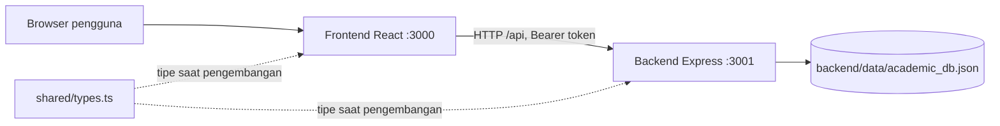

# Panduan mempelajari sistem

## Gambaran program

Program ini adalah aplikasi demo monitoring akademik dengan dua peran: guru dan siswa. Tahun ajaran awal adalah `2026/2027`, semester `Ganjil`. Data contoh berisi tiga guru, delapan siswa, empat kelas, dan enam mata pelajaran. Data siswa serta penugasan tidak terisi pada semua kelas/mapel yang didefinisikan.

| Modul | Guru | Siswa |
| --- | --- | --- |
| Dashboard | Ringkasan kelas, siswa, kehadiran, dan penilaian | Ringkasan kehadiran dan nilai pribadi |
| Absensi | Mengisi pertemuan dan mengoreksi kehadiran | Melihat rekap pribadi |
| Nilai tugas | Membuat tugas dan menyimpan nilai | Melihat nilai sendiri |
| UTS / UAS | Menyimpan dan memperbarui nilai | Melihat nilai sendiri |
| Rekap nilai | Mengatur bobot dan melihat nilai akhir | Melihat rekap pribadi |
| Notifikasi orang tua | Melihat simulasi pesan dan tautan WhatsApp | Tidak ada menu khusus |
| Profil | Melihat profil dan mengganti password | Melihat profil dan mengganti password |

## Pemisahan tanggung jawab



Dalam pengembangan, browser mengakses `/api` pada origin frontend. Vite meneruskannya ke backend port 3001. Untuk deployment berbeda domain, browser dapat menggunakan alamat API absolut dan backend mengizinkan origin frontend melalui CORS.

Backend tidak mengimpor React, Vite, komponen UI, atau file sumber frontend. Backend juga tidak melayani HTML/frontend. Paket `shared` hanya berisi tipe TypeScript yang dihapus saat kompilasi, sehingga tidak membawa kode Node ke browser.

## Urutan membaca kode

1. `frontend/src/App.tsx`: menentukan halaman login atau layout utama dan halaman aktif.
2. `frontend/src/context/AuthContext.tsx`: sesi pengguna, login/logout, pilihan semester, dan tahun ajaran.
3. `frontend/src/components/Sidebar.tsx`: menu yang tersedia bagi setiap peran.
4. `frontend/src/views/`: tampilan dan interaksi tiap modul.
5. `frontend/src/lib/api.ts`: seluruh permintaan HTTP frontend, token, dan penanganan kesalahan koneksi.
6. `shared/types.ts`: struktur kelas, siswa, tugas, absensi, nilai, rekap, dan profil.
7. `backend/src/index.ts`: menjalankan listener API dan menghentikannya ketika menerima sinyal.
8. `backend/src/app.ts`: CORS, JSON parser, health check, pemasangan router, serta respons kesalahan.
9. `backend/src/routes.ts`: autentikasi, aturan akademik, filter data, dan perhitungan rekap.
10. `backend/src/db.ts`: data awal, hashing password, sesi dalam memori, dan baca/tulis file JSON.
11. `backend/src/config.ts`: membaca `.env` dan menentukan path data yang konsisten.
12. `backend/test/api.test.ts`: contoh permintaan lengkap serta uji alur utama pada database sementara.

## Alur login

1. Pengguna memilih guru/siswa dan memasukkan NIP/NIS serta password.
2. Frontend mengirim `POST /api/auth/login`.
3. Backend memeriksa akun dan hash password PBKDF2.
4. Backend membuat token acak dan menyimpan sesi dalam memori.
5. Browser menyimpan token di `sessionStorage`, lalu menambahkan header `Authorization: Bearer ...` pada setiap permintaan.
6. Saat halaman dimuat ulang, `GET /api/auth/me` memulihkan profil pengguna.
7. Logout menghapus sesi backend dan token browser. Masa sesi maksimum tujuh hari; restart backend juga menghapus sesi.

## Alur absensi

Guru memilih kelas, mata pelajaran, tahun ajaran, semester, nomor pertemuan, dan tanggal. API mengembalikan siswa beserta kehadiran yang telah dicatat. Ketika disimpan, backend memeriksa penugasan guru, membuat atau memperbarui pertemuan, menyimpan absensi, dan mencatat riwayat jika status berubah.

Status yang dicatat adalah Hadir, Izin, Sakit, atau Alpa. `Belum diisi` dilewati. Rekap menghitung persentase hadir dari pertemuan yang memiliki catatan siswa tersebut. Absensi Izin/Sakit/Alpa menghasilkan data contoh notifikasi orang tua, tanpa menghubungi layanan pesan eksternal.

## Alur nilai

Guru membuat tugas untuk suatu kelas/mapel, kemudian memasukkan nilai siswa melalui penyimpanan batch. Nilai tugas dan ujian disimpan dalam koleksi yang berbeda. Nilai dapat berupa angka 0–100 atau `null` jika belum diisi.

Bobot awal adalah 40% tugas, 30% UTS, dan 30% UAS. Rekap menghitung:

```text
rata-rata tugas = jumlah nilai tugas yang terisi / banyaknya tugas yang sudah dinilai
nilai akhir = (rata-rata tugas × bobot tugas + UTS × bobot UTS + UAS × bobot UAS) / 100
```

Nilai akhir baru dihitung jika rata-rata tugas, UTS, dan UAS tersedia. Ambang ketuntasan dalam kode adalah 75; angka ini adalah aturan demo yang perlu disesuaikan jika kebijakan sekolah berbeda. Tugas yang belum dinilai tidak ikut pembagi rata-rata.

## Kelompok endpoint

Semua path berikut diawali `/api`.

| Metode | Path | Fungsi |
| --- | --- | --- |
| GET | `/health` | Pemeriksaan status API tanpa login |
| POST | `/auth/login` | Login |
| GET | `/auth/me` | Profil sesi aktif |
| POST | `/auth/logout`, `/auth/change-password` | Logout dan ganti password |
| GET | `/classes`, `/subjects`, `/students` | Data kelas, mapel, siswa |
| GET | `/attendance`, `/attendance/recap`, `/attendance/history` | Absensi, rekap, koreksi |
| POST | `/attendance/save` | Simpan absensi guru |
| GET / POST | `/tasks` | Daftar atau pembuatan tugas |
| DELETE | `/tasks/:id` | Hapus tugas dan nilainya |
| GET | `/grades`, `/grades/recap` | Nilai dan rekap |
| POST | `/grades/batch` | Penyimpanan nilai guru |
| GET / PUT | `/weights` | Baca/ubah bobot |
| GET | `/notifications` | Data simulasi notifikasi |
| POST | `/notifications/:id/send` | Memperbarui status simulasi |
| GET | `/dashboard` | Ringkasan sesuai peran |
| POST | `/system/reset-demo` | Reset data; membutuhkan login guru |

## Penyimpanan dan perubahan struktur

Sebelumnya `server.ts` menjalankan Express dan memasang Vite sebagai middleware. File server mengimpor tipe dari `src/types.ts`, dan penyimpanan bergantung pada folder kerja saat proses dijalankan.

Sekarang setiap aplikasi mempunyai `package.json`, `.env.example`, konfigurasi TypeScript, dan perintah build sendiri. `shared/types.ts` menjadi sumber tipe bersama. `backend/src/config.ts` menentukan direktori data relatif terhadap folder backend sehingga `npm run dev:backend`, `cd backend; npm run dev`, serta `node backend/dist/index.js` mengarah ke data yang sama.

Penyimpanan menggunakan file sementara lalu rename untuk mengganti JSON. Kesalahan membaca database tidak lagi diam-diam mengembalikan data awal. Kesalahan tulis diteruskan sebagai kegagalan API. Data uji dibuat di direktori sementara tersendiri agar tidak mengubah database aplikasi yang sedang digunakan.

## Batasan implementasi yang ditemukan

- Ini masih aplikasi demo dengan akun dan data contoh. Belum ada fitur administrasi untuk membuat akun, kelas, siswa, atau penugasan melalui UI.
- Database JSON dan sesi dalam memori sesuai untuk satu proses lokal. Beberapa instance backend belum berbagi sesi atau mengunci penulisan data bersama.
- Label notifikasi `Terkirim` pada kode lama merupakan simulasi; tidak menunjukkan konfirmasi pengiriman WhatsApp nyata.
- Filter periode belum diterapkan ke semua ringkasan dashboard; beberapa ringkasan masih menghitung seluruh data yang tersedia.
- Pemeriksaan penugasan guru pada endpoint lama belum merata. Form absensi dan simpan nilai memeriksa penugasan, sementara beberapa endpoint lain masih hanya memeriksa peran/login. Pemisahan ini belum merupakan audit menyeluruh hak akses.
- Validasi batch nilai lama berlangsung selama iterasi. Input tidak valid setelah baris yang valid dapat mengubah sebagian data dalam memori sebelum permintaan ditolak; transaksi database belum tersedia.

Pemisahan mempertahankan alur bisnis yang ada. Perubahan tambahan yang sudah dilakukan adalah pengaturan URL API/CORS, error API berbentuk JSON, path data yang stabil, penolakan database rusak, serta pembatasan reset demo hanya untuk guru.

## Verifikasi

`npm run lint` memeriksa ketiga workspace. `npm test` menguji health, CORS/preflight, autentikasi, akses siswa, dashboard, absensi/koreksi, tugas/nilai/bobot, penyimpanan lintas proses, ganti password, dan logout. `npm run build` menghasilkan frontend statis dan backend ESM yang dapat dijalankan sendiri.
